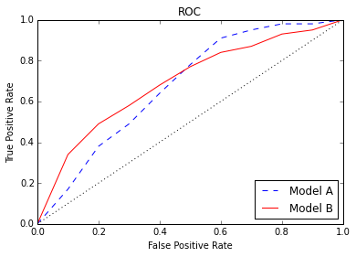

1. You fit a linear regression to predict SAT score with many predictors, one of which is whether or not the student was homeschooled. `Beta_homeschool = -40`. How do you interpret the coefficient? How do you justify the validity of this finding?  What might compromise the validity of the finding?


2. You fit a logistic regression to predict whether or not a student was admitted to a 4-year university. This time `Beta_homeschool = -0.3`. Do we predict that more or less homeschoolers are admitted? Are 30% more/less homeschoolers admitted? How do you justify this finding?


3. Give an example of a confusion matrix with precision > 90% and recall < 10%.

  solve for where TP/(TP+FP) = .91  and where TP/(TP+FN) = .09

   1     0
1  10   101
0  1    doesnt matter

4. Give an example of a confusion matrix with accuracy > 90%, but both precision < 10% and recall < 10%.

  Solve for where (TP+TN)/TOTAL =.91 TP/(TP+FP) =.09 and PT/(TP+FN) =.09


5. Take a look at this ROC plot. Assume that we're building a model for a spam filter. We prefer to let spam messages go to the inbox rather than to let nonspam go to the spam folder. Interpreting a true positive as correctly identifying spam, which model should we choose?

    Choose model B as it seems to have a quickly gains a good false positive with little false negative. As you do not want to falsely classify email as spam you want to keep a low false positive rate so you will keep the true positive rate low as well to keep email from being incorrectly classified

    


6. Looking at the same ROC plot, assume that we're building a model for a fraud detector. There is a huge cost to missing potential fraud. If we suspect something as fraud we will investigate it further.  Interpreting a true positive as correctly identifying fraud which model should we choose?

  I would choose Model A and look to have true positive rate above .80.  This will help maximize the True Positive and minimize the False Positives.  Form this plot a good starting place would be .9 True positive as going higher starts to quickly increase false Positives

7. Say I'm building a Decision Tree Classifier on this dataset.

    | color | number | label |
    | ----- | ------ | ----- |
    | blue  | 1      | 0     |
    | blue  | 2      | 1     |
    | red   | 1      | 0     |
    | red   | 5      | 1     |

    Splitting on what feature and value has the best information gain? Use your intuition rather than calculating all the entropy values.

      Spliting number will give you the best IG.  Splitting on number = 1 will give a perfect split for the given data.  

8. Say I'm building a Decision Tree Regressor. What is the information gain of this split of the data?

    ```
    Split A: 6, 5, 8, 8
    Split B: 5, 4, 2, 4, 4
    ```


9. You build a Decision Tree and get these stats:

    ```
    train set accuracy:  90%
    train set precision: 92%
    train set recall:    87%

    test set accuracy:   60%
    test set precision:  65%
    test set recall:     52%
    ```

    What's going on? What tactic(s) do we have to modify our Decision Tree to fix the issue?

      It looks like it might be overfitting.  We can limit the number of leafs, tree depth, and splits.  We can also try pruning methods and removal / modification to parameters


10. How are the Decision Trees in Random Forests different from standard Decision Trees?

  The process of choosing a value to split on restricts the number of values it can assess.  This will cause trees to be far more varied and as it only has a subset of parameters to choose from for each split.  


11. Why are we able to cross validate our Random Forest with our training set (OOB error)? I.e. Why doesn't this count as testing on my training set?

    Bootstrapping on average only uses about 2/3 of the sample values (because selection is done with replacement) which allows us to test our trees on the remaining 1/3 of values not used.
    This is not testing on your training set the same way K folds is not.  The 1/3 was never used in the training so it can be used for testing.


12. Say I have 50 machines that I can use to build my model. Which of these ensemble methods can utilize multiple machines?

    * Random Forest
    * Gradient Boosting
    * AdaBoost

    Random forest can because the creation / results are independent for each other.
    Boosting uses a weak learner style so the results from one run are needed to do the next.


13. In binary decision tree scikit-learn boosting, how many total leaf nodes are produced with a `max_depth` hyperparameter set to n?  Would we expect our prediction score to improve or be reduced if we instead used the `max_leaf_nodes` hyperparameter set to the previous answer for the total number of leaf nodes produced?


14. In boosting, what is the relationship between the hyperparameters `learning_rate` and `n_estimators`?

    n_estimators is the number of boosting  stages preformed.  Each stage's modification / learning improvement is shrink by the learning_rate. So if you decrease the learning rate you can increase the n_estimators.  


15. In boosting, why might we want to tune `max_features` and `sub_sample`? What purpose does it serve?

    max_features can be used to restrict the number of features in boosting making it smaller then n will result in a reduction of variance
    and an increase in bias.


16. In Random Forests, what do you expect to happen to the test error as you build more trees? How is this different from increasing the number of trees in Boosting?

    You will eventually start to increase test error as you will start overfitting and as you increase the number of trees.  The correlation from Bootstrapping increases as the samples from it increase.

    Increasing the number of trees in gradient boosting will eventually over fit as well but it will take much longer as we are slowly following the gradient decent and slowly improving on previous learning.


17. Name the tuning parameters for the following algorithms and describe what you'd expect to happen with bias and variance as you increase the tuning parameter.

    * Lasso / Ridge
        alpha
    * SVM
        C, degree, gamma, kernel
